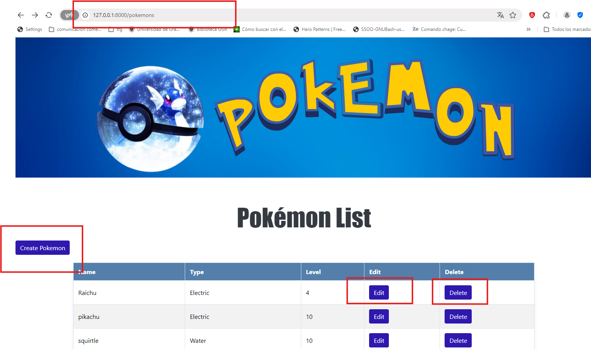
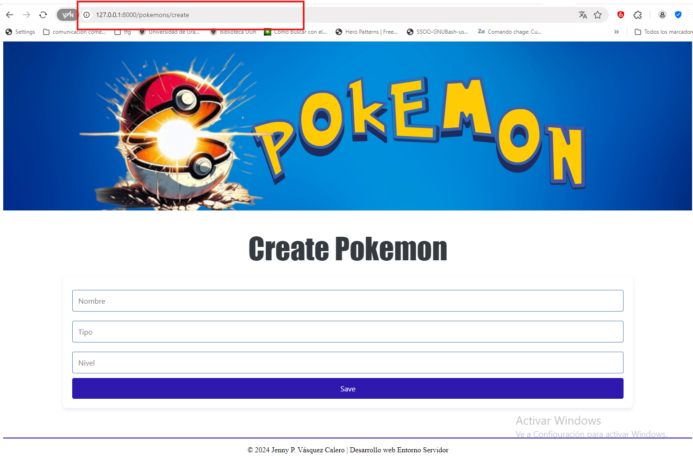
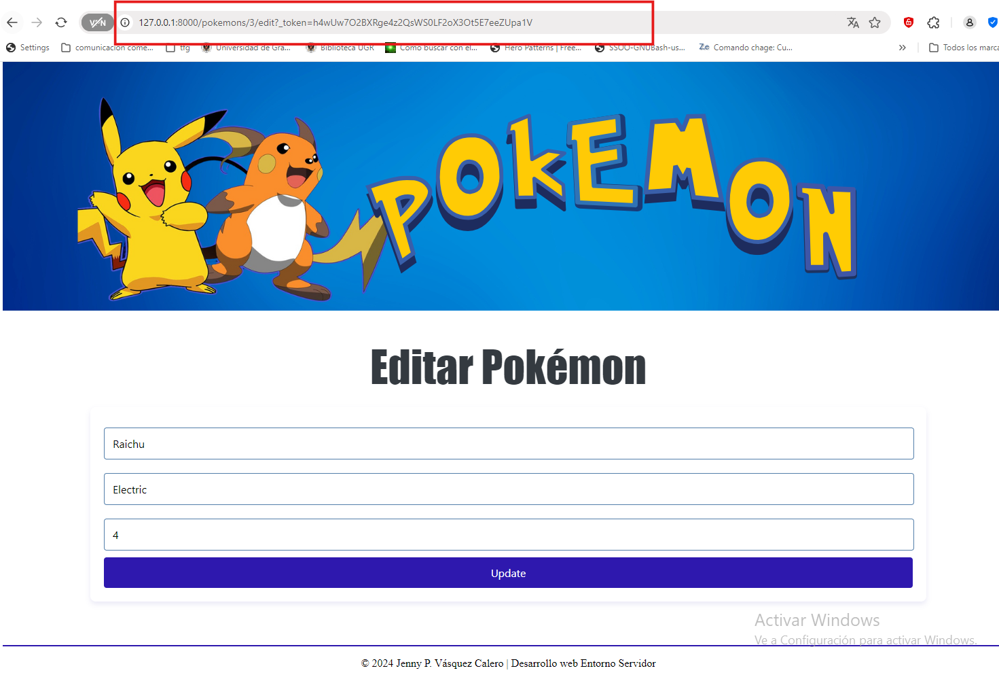
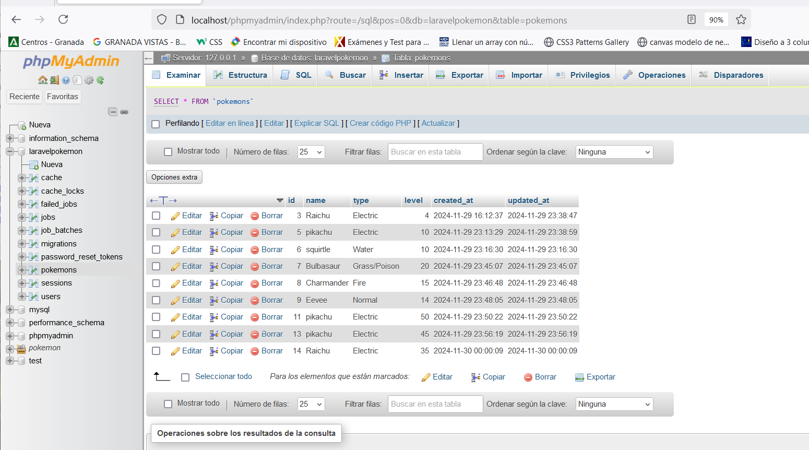
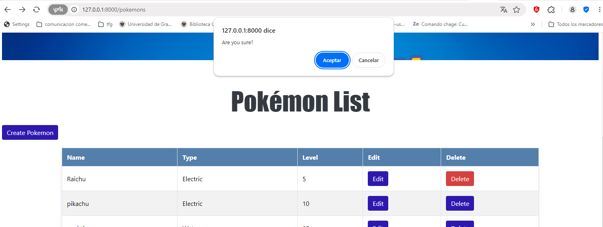
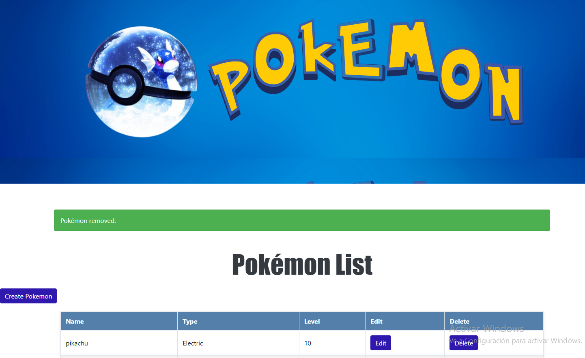
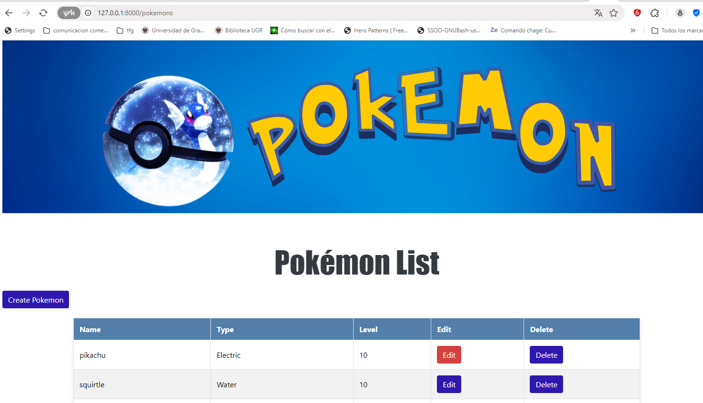
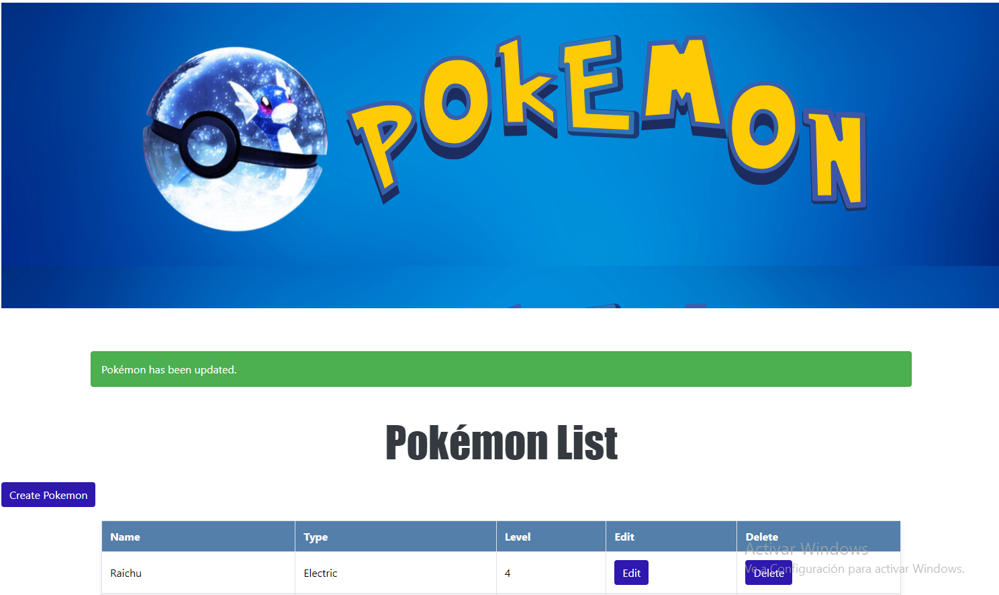

# Proyecto CRUD Pokémon con Laravel

## Descripción del Proyecto
Este proyecto es una aplicación CRUD (Create, Read, Update, Delete) para gestionar una lista de Pokémon.Se ha desarrollado utilizando **Laravel** y está configurado para funcionar de forma local en un servidor **XAMPP**.







---

## Requisitos Previos

### 1. Instalar XAMPP
### 2. Extensiones PHP requeridas para Laravel
He tenido que asegurarme que las siguientes extensiones están habilitadas en el archivo o php.ini

- `pdo`
- `pdo_mysql`
- `openssl`
- `mbstring`
- `tokenizer`
- `xml`
- `ctype`
- `json`
- `bcmath`

#### Habilitar las extensiones para ello:
1. Buscamos el archivo `php.ini` ubicado en `C:/xampp/php/php.ini`.
2. Buscamos las extensiones y eliminamos el `;` al inicio si están comentadas.
3. Reiniciamos XAMPP para aplicar los cambios.

### 3. Instalar Composer
Descarga e instala [Composer](https://getcomposer.org).

### 4. Instalar Laravel
Una vez instalado Composer, hemos instalado Laravel globalmente en nuestra máquina ejecutando el siguiente comando:
```bash
composer global require laravel/installer
```

---

## Configuración del Proyecto

### 1. Configuración del archivo `.env`
He modifica el archivo `.env` en el directorio raíz del proyecto con la información de conexión de nuestra base de datos MySQL:
```env
DB_CONNECTION=mysql
DB_HOST=127.0.0.1
DB_PORT=3306
DB_DATABASE=laravelPokemon
DB_USERNAME=root
DB_PASSWORD= 
```

### 2. hemos creado la Base de Datos
Para ello hemos usado **phpMyAdmin** para crear una base de datos llamada `laravelPokemon`. Luego, hemos creado la tabla `pokemons` utilizando la siguiente migración:
```php
public function up(): void
{
    Schema::create('pokemons', function (Blueprint $table) {
        $table->id();
        $table->string('name');
        $table->string('type');
        $table->integer('level');
        $table->timestamps();
    });
}
```



---
Los archivos que hemos utilizado en este proyecto son los siguientes:

Estructura del Proyecto

```plaintext
pokemon_crud/
├── app/
│   ├── Http/
│   │   ├── Controllers/
│   │   │   ├── PokemonController.php
│   ├── Models/
│   │   ├── Pokemon.php
├── resources/
│   ├── views/
│   │   ├── pokemons/
│   │   │   ├── index.blade.php
│   │   │   ├── create.blade.php
│   │   │   ├── edit.blade.php
├── routes/
│   ├── web.php
└── .env
```

---

## Rutas

### Definición de Rutas
Las rutas están definidas en el archivo `routes/web.php`:
```php
use App\Http\Controllers\PokemonController;

Route::resource('pokemons', PokemonController::class);
```

Este método crea automáticamente todas las rutas CRUD necesarias (index, create, store, show, edit, update, destroy) y las vincula con el controlador `PokemonController`.

### Rutas generadas
- `GET /pokemons` → Muestra todos los Pokémon (index).
- `GET /pokemons/create` → Muestra el formulario para crear un Pokémon (create).
- `POST /pokemons` → Guarda un nuevo Pokémon (store).
- `GET /pokemons/{id}` → Muestra un Pokémon específico (show).
- `GET /pokemons/{id}/edit` → Muestra el formulario para editar un Pokémon (edit).
- `PUT /pokemons/{id}` → Actualiza un Pokémon existente (update).
- `DELETE /pokemons/{id}` → Elimina un Pokémon (destroy).

---

## Mensajes de Éxito
En el controlador `PokemonController` se manejan mensajes de éxito al realizar acciones:

### Eliminar un Pokémon
```php
public function destroy(Pokemon $pokemon)
{
    $pokemon->delete();
    return redirect()->route('pokemons.index')->with('success', 'Pokémon removed.');
}
```




### Actualizar un Pokémon
```php
public function update(Request $request, Pokemon $pokemon)
{
    $pokemon->update($request->all());
    return redirect()->route('pokemons.index')->with('success', 'Pokémon has been updated!');
}
```





---

## Ventanas Emergentes


Se utiliza JavaScript para confirmar la eliminación de un Pokémon:
```html
<form action="{{ route('pokemons.destroy', $pokemon) }}" method="POST"
    style="display:inline;" onsubmit="return confirm('Are you sure?')">
    @csrf
    @method('DELETE')
    <button type="submit">Delete</button>
</form>
```

